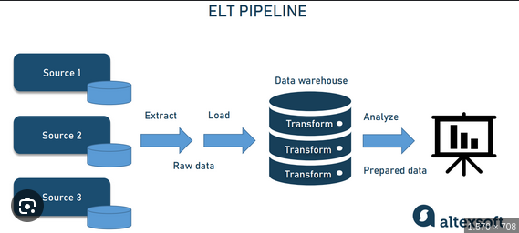

### Data Engineer

Infraestrutura:

- Consistência dos dados;
- Persistência dos dados;
- Pipeline fluido.

1. Compreensão do Negócio
2. Compreensão dos Dados
3. Preparação de Dados
4. Modelagem
5. Avaliação
6. Implantação